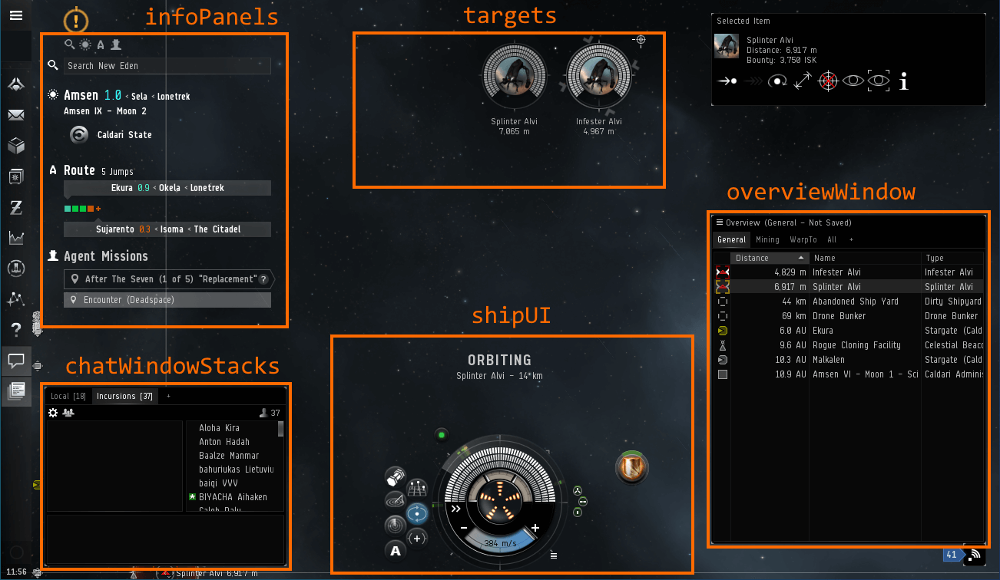
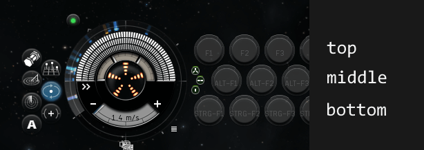
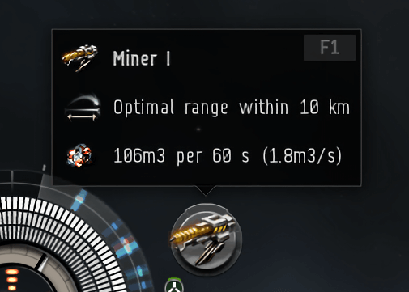
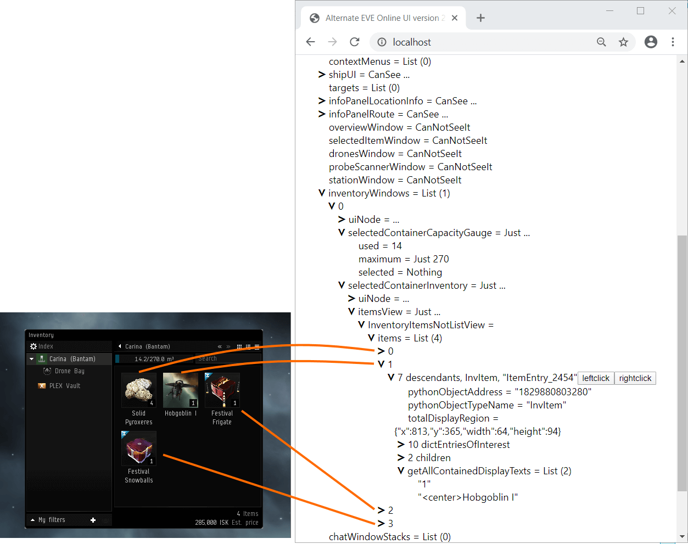

# Parsed User Interface of the EVE Online Game Client

The parsed user interface is a common way to access parts of the user interface of the game client. It guides you while writing code by providing Elm types and functions for popular derivations from the UI tree.

The UI tree in the EVE Online client can contain thousands of nodes and tens of thousands of individual properties. Because of this large amount of data, navigating in there can be time-consuming. To make this easier, this library filters and transforms the memory reading result into a form that contains less redundant information and uses names more closely related to the experience of players; for example, the overview window or ship modules.

In the program code, we find the implementation in the module [`EveOnline.ParseUserInterface`](https://github.com/Viir/bots/blob/7d14efac63081544b7c0d6c6ecc04adc15db367d/implement/applications/eve-online/eve-online-mining-bot/EveOnline/ParseUserInterface.elm).

Years of feedback from developers have shaped this library to contain shortcuts to the often used UI elements. Let's look at the root type to get a general idea of what we can find there:

```Elm
type alias ParsedUserInterface =
    { uiTree : UITreeNodeWithDisplayRegion
    , contextMenus : List ContextMenu
    , shipUI : MaybeVisible ShipUI
    , targets : List Target
    , infoPanelContainer : MaybeVisible InfoPanelContainer
    , overviewWindow : MaybeVisible OverviewWindow
    , selectedItemWindow : MaybeVisible SelectedItemWindow
    , dronesWindow : MaybeVisible DronesWindow
    , fittingWindow : MaybeVisible FittingWindow
    , probeScannerWindow : MaybeVisible ProbeScannerWindow
    , stationWindow : MaybeVisible StationWindow
    , inventoryWindows : List InventoryWindow
    , chatWindowStacks : List ChatWindowStack
    , agentConversationWindows : List AgentConversationWindow
    , marketOrdersWindow : MaybeVisible MarketOrdersWindow
    , surveyScanWindow : MaybeVisible SurveyScanWindow
    , repairShopWindow : MaybeVisible RepairShopWindow
    , moduleButtonTooltip : MaybeVisible ModuleButtonTooltip
    , neocom : MaybeVisible Neocom
    , messageBoxes : List MessageBox
    , layerAbovemain : MaybeVisible UITreeNodeWithDisplayRegion
    }
```

Using the `uiTree` field, we can access the raw UI tree. All the other fields contain derivations of the UI tree for easier access.

In case the names aren't clear, this annotated screenshot of the game client illustrates what is what, at least for some of the more popular elements:



## Ship UI

```Elm
type alias ShipUI =
    { uiNode : UITreeNodeWithDisplayRegion
    , capacitor : ShipUICapacitor
    , hitpointsPercent : Hitpoints
    , indication : MaybeVisible ShipUIIndication
    , moduleButtons : List ShipUIModuleButton
    , moduleButtonsRows :
        { top : List ShipUIModuleButton
        , middle : List ShipUIModuleButton
        , bottom : List ShipUIModuleButton
        }
    , offensiveBuffButtonNames : List String
    }
```

### Capacitor

```Elm
type alias ShipUICapacitor =
    { uiNode : UITreeNodeWithDisplayRegion
    , pmarks : List ShipUICapacitorPmark
    , levelFromPmarksPercent : Maybe Int
    }
```

Use the field `levelFromPmarksPercent` to get the capacitor level in percent.

### Module Buttons

```Elm
type alias ShipUIModuleButton =
    { uiNode : UITreeNodeWithDisplayRegion
    , slotUINode : UITreeNodeWithDisplayRegion
    , isActive : Maybe Bool
    , isHiliteVisible : Bool
    , rampRotationMilli : Maybe Int
    }
```

The ship UI displays ship modules in the form of module buttons. One module button can represent a single module or multiple grouped modules. We can look at these module buttons to learn about the state of the modules, and we can also click on them to toggle the module activity.

Some apps identify ship modules by their display location because this is faster than reading the tooltips. You can find some app descriptions calling for arranging modules into the three rows by use. To access the modules grouped into `top`, `middle`, and `bottom`, use the field `moduleButtonsRows`.



The [mining bot example project](https://github.com/Viir/bots/blob/33c87ea20aeda88ed5f480c27fdbb4f0d8808d29/implement/applications/eve-online/eve-online-mining-bot/BotEngineApp.elm) also uses modules this way.

## Module Button Tooltip



```Elm
type alias ModuleButtonTooltip =
    { uiNode : UITreeNodeWithDisplayRegion
    , shortcut : Maybe { text : String, parseResult : Result String (List Common.EffectOnWindow.VirtualKeyCode) }
    , optimalRange : Maybe { asString : String, inMeters : Result String Int }
    }
```

The module button tooltip helps us to learn more about the module buttons displayed in the ship UI. This UI element appears when we move the mouse over a module button and shows details of the ship module(s) it represents.

Use the function `getAllContainedDisplayTexts` to get the texts contained in the tooltip.

Besides information about the modules, the tooltip also shows the keyboard shortcut to toggle the activity of the module(s). The framework parses these into representations of the keyboard keys. You can use this list of keys to toggle modules without using the mouse.

### Linking a Tooltip With Its Module Button

For the module button tooltip to be useful, we usually want to know which module button it belongs to. The easiest way to establish this link is by using the `isHiliteVisible` field on the module button: When you move the mouse over a module button to trigger the tooltip, you can see `isHiliteVisible` switches to `True` for the module button. Apps use this approach and then remember the tooltip for each module button. There are common functions to update a memory structure holding this information, most importantly `integrateCurrentReadingsIntoShipModulesMemory` in the mining bot example.

## Inventory Window

To work with items in the inventory, use the property `selectedContainerInventory` in the inventory window. In the property `itemsView`, you get this list of items visible in the selected container:



Are looking for an item with a specific name? You could use the filtering function in the game client, but there is an easier way: Using the function `getAllContainedDisplayTexts` on the inventory item, you can filter the list of items immediately.

As you can also see in the screenshot of the live inspector, we get the used, selected, and maximum capacity of the selected container with the property `selectedContainerCapacityGauge`. You can compare the `used` and `maximum` values to see if the container is (almost) full. The [mining bot does this](https://github.com/Viir/bots/blob/33c87ea20aeda88ed5f480c27fdbb4f0d8808d29/implement/applications/eve-online/eve-online-mining-bot/BotEngineApp.elm#L993-L998) on the ore hold to know when to travel to the unload location.

## Repairshop Window

In Repairshop window you can repair your ship.

```
type alias RepairShopWindow =
    { uiNode : UITreeNodeWithDisplayRegion
    , items : List UITreeNodeWithDisplayRegion
    , repairItemButton : MaybeVisible UITreeNodeWithDisplayRegion
    , pickNewItemButton : MaybeVisible UITreeNodeWithDisplayRegion
    , repairAllButton : MaybeVisible UITreeNodeWithDisplayRegion
    }
```


