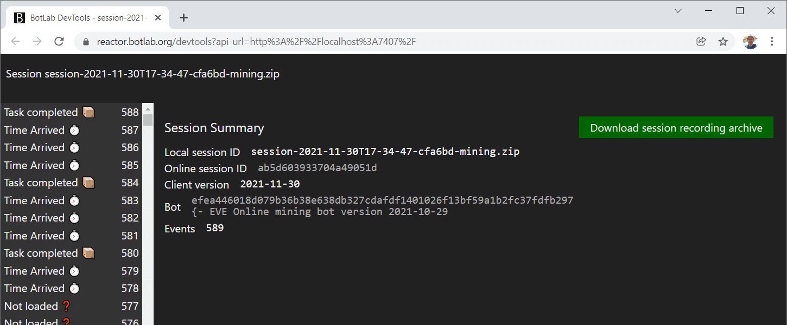
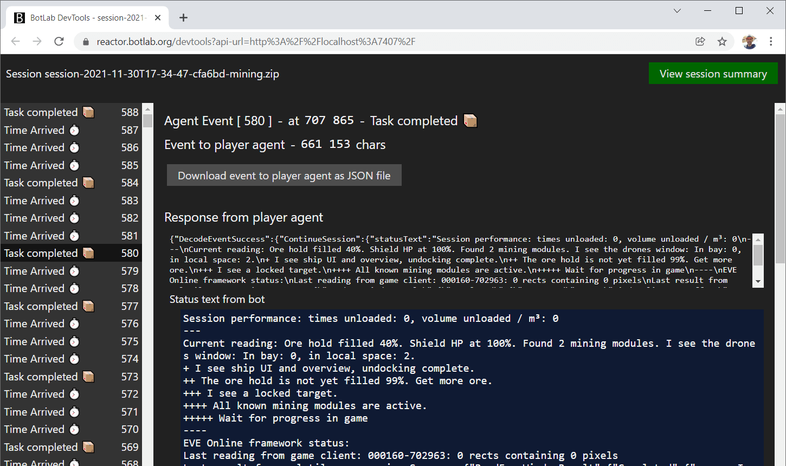
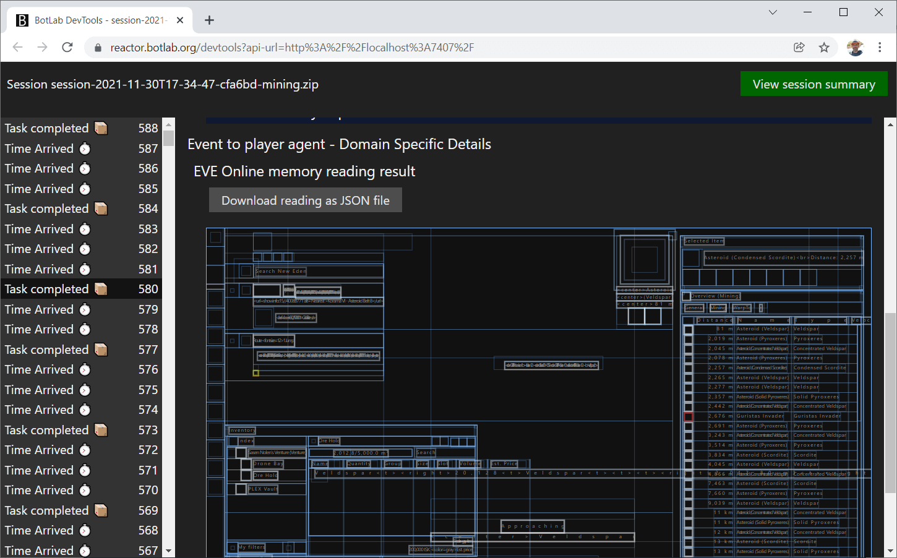
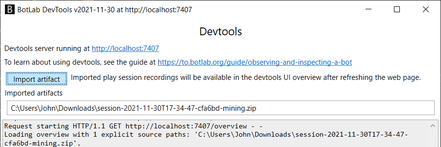
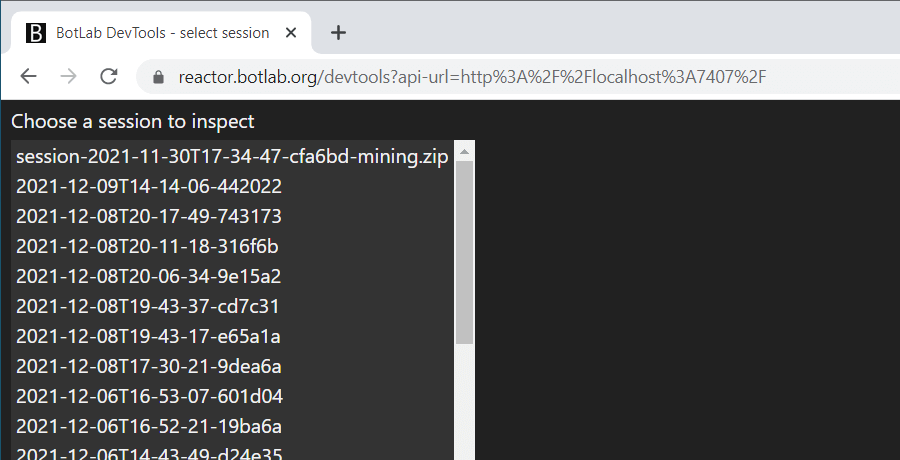

# Observing and Inspecting a Bot

Observations are the basis for improving a bot.

One way of observing a bot is to watch the BotLab client window and the game client on a screen. That is what you see anyway when running a bot. The BotLab client window displays the status text from the bot and thus helps with the inspection.

But this mode of observing is limiting in two ways.

It is limiting because it requires us to process everything in real-time. But in most cases, information flows too fast for us to keep up. Things happen so quickly that we cannot even read all the status messages. We could pause the bot to have more time to read, but that leads to other problems since every break distorts the bot's perception of the environment.

The second limitation is the merely superficial representation we find in this mode. To understand how a bot works, we need to make visible more than just the status texts. When investigating a bot's behavior, we want to follow the data-flow backward. Seeing the status text and the effects emitted by the bot in response to an event is only the first step in this process.

While this simple way of observing is severely limiting, it can work. We can offset the incomplete observations with more experiments. Ten hours of tests could save us one hour of careful inspection.

But we don't have to make it so difficult for ourselves. These problems with observability are not new, and there are tools to help us overcome these limitations.

## DevTools and Time Travel

The first step to enable observability is to decouple the observation time from the bot running time. Our development tools allow us to go back to any point in time and see everything as it was back then.

Let's see how this works in practice.
To travel back in time, we need a play session recording. The BotLab client automatically saves a recording to disk by default when we run a bot.

To inspect completed play sessions, we use the `Devtools` in the BotLab client:

A button in the main menu brings us into the `Devtools` view:

Here we see a link to a web page on the `localhost` domain. Clicking that link brings opens a web browser. The actual graphical user interface for the Devtools is on this web page.

On that web page, we find a list of recent sessions, the last one at the top:

Clicking on one of the sessions' names brings us into the view of this particular session:

In the session view, we have a timeline of events in that session. Clicking on an event in the timeline opens the details for this event. The event details also contain the bot's response to this event.

Besides the complete response, we also see the status text, which is part of the response but repeated in a dedicated section for better readability.

Some events inform the bot about the completion of reading from the game client. For these events, the event details also show a visualization of the reading. For EVE Online, a common way to read from the game client is using memory reading. That is why we don't see a screenshot here, but a (limited) visualization.

This visualization shows the display regions of UI elements and some of the display texts. Using the button "Download reading as JSON file", we can export this memory reading for further examination. The inspection tools found in the alternate UI for EVE Online help us with that. You can find those tools at <https://botlabs.blob.core.windows.net/blob-library/by-name/2023-06-21-eve-online-alternate-ui.html>
(If you want to enable the Elm inspector ('debugger') tool too, you can use the variant at <https://botlabs.blob.core.windows.net/blob-library/by-name/2023-06-21-eve-online-alternate-ui-with-inspector.html>)

## Sharing Observations

To collaborate on the development of a bot, we often need to communicate scenarios, situations in which we want the bot to work. One way to describe such a scenario is to use the recording of an actual session as it happened. To export any session displayed in the DevTools, use the `Download session recording archive` button. This gets you a zip archive that you can then share with other people. Now you can get help from other developers for your exact situation, no matter if the solution requires a change in program code or just different bot-settings.

To import such a session archive in DevTools, use the `import artifact` button in the Devtools view in the botlab client:

When you start DevTools this way, the session from the specified path will show up at the top of the list of sessions in the DevTools UI:

